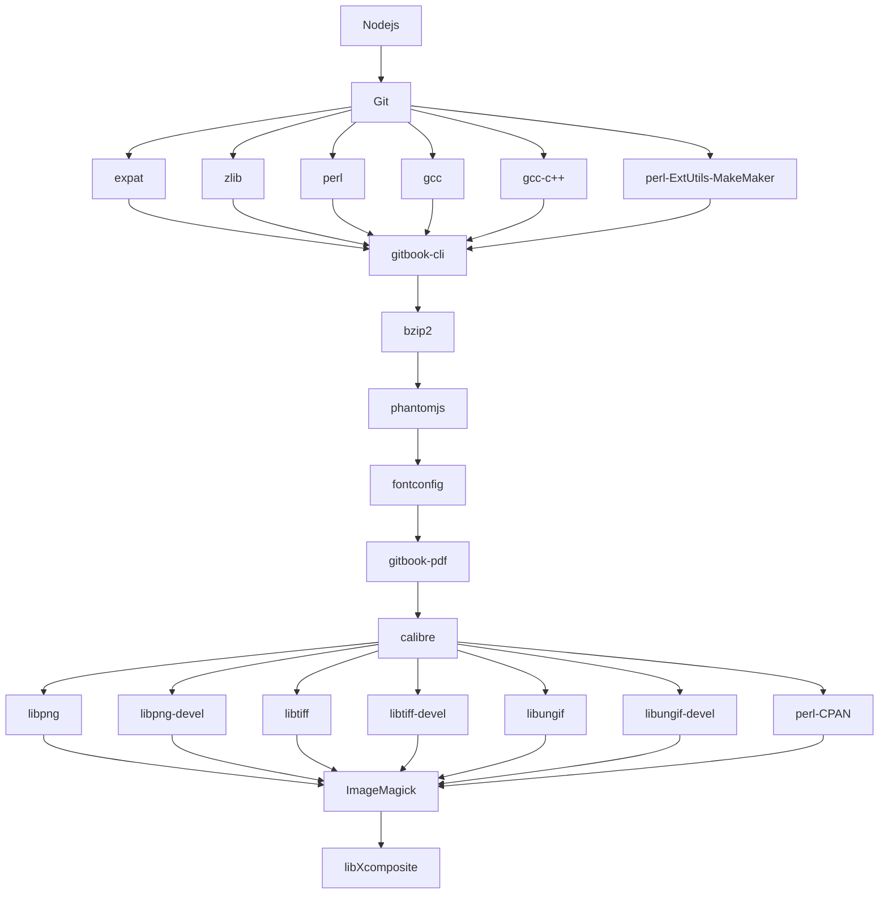

# 本章小结
&nbsp;&nbsp;&nbsp;&nbsp;&nbsp;&nbsp;通过以上章节,我们可以搭建出一套完整的 GitBook 环境,进行我们的电子书编写之旅.
##### 安装流程图
---

##### 我们需要安装的软件
---
 - node.js
 - git
 - gitbook
 - wget

##### 我们需要安装的依赖及插件
---
 - gitbook-cli
 - bzip2
 - phantomjs
 - fontconfig
 - gitbook-pdf -g
 - calibre
 - libjpeg
 - libjpeg-devel
 - libpng
 - libpng-devel
 - libtiff
 - libtiff-devel
 - libungif
 - libungif-devel
 - perl-CPAN
 - ImageMagick
 - libXcomposite
 - gcc
 - gcc-c++

##### 参考资料
---
[安装 Node.js](http://www.ttxit.com/thread-24-1-1.html) 
[安装 Git](http://www.ttxit.com/thread-21-1-1.html) 
[安装 GitBook](http://www.ttxit.com/thread-25-1-1.html) 
[安装 phantomjs](http://www.ttxit.com/thread-32-1-1.html)