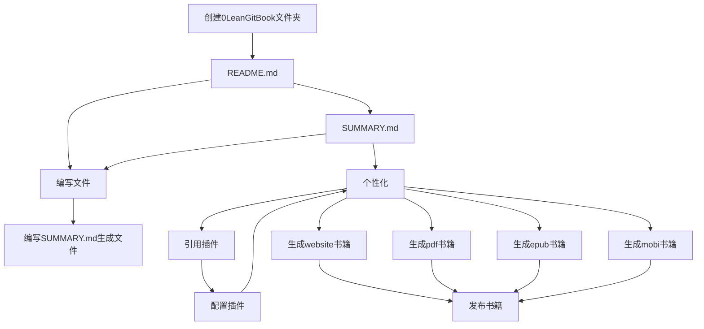

# 第七章 GitBook 实战 - 从零学习 GitBook
&nbsp;&nbsp;&nbsp;&nbsp;&nbsp;&nbsp;GitBook 我们已经学完了,我们需要实际操作编写一本书籍,以下章节便是本书籍的主要文件.该书籍主要流程如下:

```mermaid
graph TD;
    创建0LeanGitBook文件夹 --> README.md
    README.md --> 编写文件
    README.md --> SUMMARY.md
    SUMMARY.md --> 个性化
    SUMMARY.md --> 编写文件
    编写文件 --> 编写SUMMARY.md生成文件
    个性化 --> 引用插件
    引用插件 --> 配置插件
    配置插件 --> 个性化
    个性化 --> 生成website书籍
    个性化 --> 生成pdf书籍
    个性化 --> 生成epub书籍
    个性化 --> 生成mobi书籍
    生成website书籍 --> 发布书籍
    生成pdf书籍 --> 发布书籍
    生成epub书籍 --> 发布书籍
    生成mobi书籍 --> 发布书籍
```