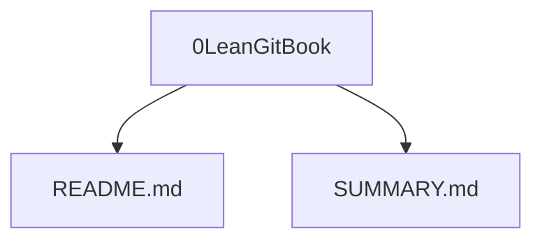

# 本章小结
&nbsp;&nbsp;&nbsp;&nbsp;&nbsp;&nbsp;通过以上章节了解的 GitBook 的主要构成,以及生成书籍的目录结构.
##### 流程图
---

一本 GitBook 的书籍是由以上不可缺少的 README.md 和 SUMMARY.md 文件构成的,这两个文件是必须存在的. README.md 文件主要是对于该书籍的描述和简介, SUMMARY.md文件主要是对该书籍的目录说明,图书生成是根据该文件创建相应的文件以及文件夹.