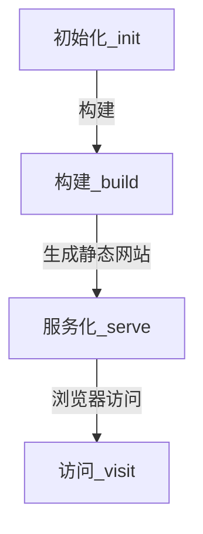
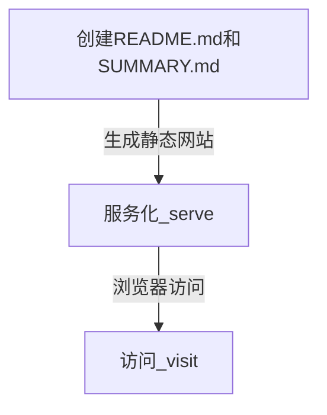

# 本章小结
&nbsp;&nbsp;&nbsp;&nbsp;&nbsp;&nbsp;通过以上章节了解了常用的 gitbook 命令.
##### 流程图
---
* **流程一**

* **流程二**

##### 流程解析
---
我们基本的流程为2种
 - 初始化(init) --> 构建(build) --> 服务化(serve) --> 访问(visit)
 - 创建 README.md 和 SUMMARY.md (create file) --> 服务化(serve) --> 访问(visit)