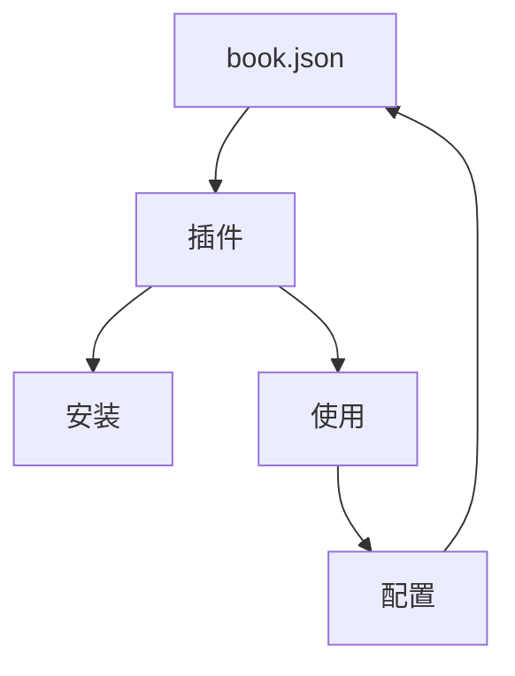

# 本章小结
&nbsp;&nbsp;&nbsp;&nbsp;&nbsp;&nbsp;通过以上章节我们学会了对书籍的自定义个性化,以及对插件的安装,以及插件在书籍中的配置使用.
##### 流程图
---

```mermaid
graph TD;
    book.json --> 插件
    插件 --> 安装
    插件 --> 使用
    使用 --> 配置
    配置 --> book.json
```

book.json --> 引用插件(提前安装) --> 配置插件