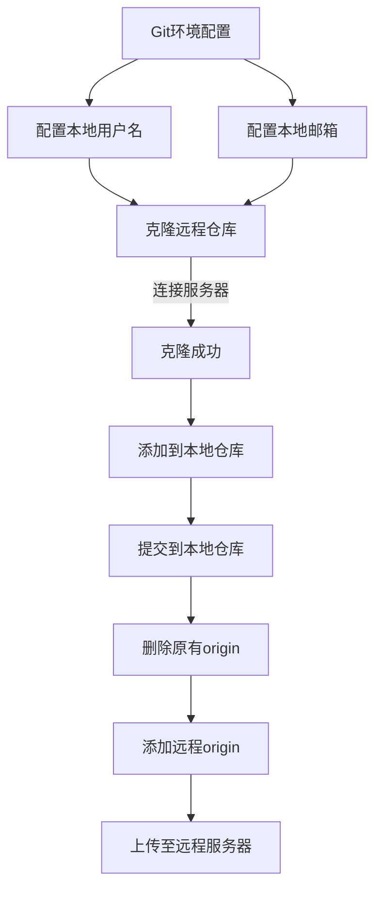

# 第六章&nbsp;&nbsp;&nbsp;GitBook 书籍发布
&nbsp;&nbsp;&nbsp;&nbsp;&nbsp;将我们编写的书籍发布到代码托管网站上以便于开源,更能方便所有人查找问题.并进行修复,以便于书籍的完成性.
##### 发布流程
---

##### 详细操作
---
* 克隆远程服务器项目

        git clone [remotepath]

* 配置全局邮箱

        git config --global user.email [useremail]

* 配置全局用户名

        git config --global user.name [username]

* 添加到本地仓库

        git add .

* 提交到本地仓库

        git commit -m [desc]

* 删除本地原有 origin

        git remote rm origin

* 添加 origin 到远程仓库

        git remote add origin [remotepath]

* 提交到远程仓库

        git push origin master
