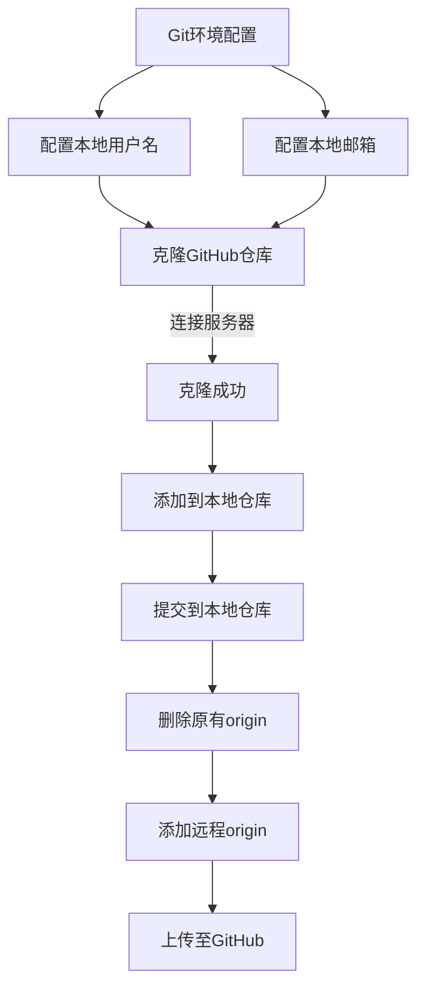

# 发布书籍至GitHub
&nbsp;&nbsp;&nbsp;&nbsp;&nbsp;&nbsp;发布书籍到 GitHub .
##### 发布流程
---

##### 详细操作
---
* 配置全局邮箱

        git config --global user.email "shichengoooo@live.com"

* 配置全局用户名

        git config --global user.name "ShrCheng"

* 克隆远程服务器项目

        git clone https://github.com/ShrCheng/0LeanGitBook.git

* 添加到本地仓库

        git add .

* 提交到本地仓库

        git commit -m '初次提交<从零学习GitBook>'

* 删除本地原有 origin

        git remote rm origin

* 添加 origin 到远程仓库

        git remote add origin https://github.com/ShrCheng/0LeanGitBook.git

* 提交到远程仓库

        git push origin master
 
提交过程:

```
Username for 'https://github.com': 输入用户名
Password for 'https://ShrCheng@github.com': 输入密码
Counting objects: 52, done.
Compressing objects: 100% (51/51), done.
Writing objects: 100% (52/52), 20.28 KiB | 0 bytes/s, done.
Total 52 (delta 12), reused 0 (delta 0)
To https://github.com/ShrCheng/0LeanGitBook.git
 * [new branch]      master -> master
```